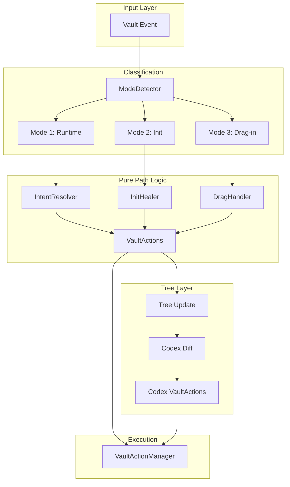

# Librarian Healing Modes Implementation

## Architecture Overview



## Three Modes

| Mode | Trigger | Source of Truth | Action |
|------|---------|-----------------|--------|
| **1: Runtime** | User rename/create/delete | User intent | Complete the move/rename |
| **2: Init** | Startup | Path | Suffix-only renames, delete empty folders |
| **3: Drag-in** | File/folder from outside | Files: suffix; Folders: path | Files: move to suffix loc; Folders: sanitize + heal |

### Mode 1: Runtime (User-Triggered)

User intent is king. We complete what they started.

| User changes | Interpretation | Our response |
|--------------|----------------|--------------|
| Basename only | "Move request" | Move file to suffix location |
| Path only | "Move done" | Fix suffix to match new path |
| Both | Path wins | Fix suffix (edge case, user's problem) |

### Mode 2: Init (Startup)

Existing paths are king. Suffix-only renames, never move.

```
Library/A/B/note_C-X-Y.md  →  Library/A/B/note_C-B-A.md
(fix suffix to match path, file stays in place)
```

Empty folders are deleted during healing.

### Mode 3: Drag-in (External Upload)

- **Single file**: Suffix wins → move to suffix location
- **Folder**: Path wins → sanitize folder name + Mode-2 style healing

```
outside/note-a-b.md → Library/note-a-b.md (user drag)
                    → Library/b/a/note-a-b.md (our response)

outside/stuff/note_X-Y.md → Library/stuff/note_X-Y.md (user drag folder)
                          → Library/stuff/note_X-stuff.md (heal suffix)
```

## Key Design Decisions

- **Tree role**: Status tracking + codex generation only
- **Rename routing**: Pure functions, no tree dependency
- **`tRef`**: Keep for file identity and content access (Obsidian maintains refs across renames)
- **`coreNameChainToParent`**: Keep for immutable/React-style updates

## Implementation

### 1. Mode Detector

New file: `src/commanders/librarian/healing/mode-detector.ts`

```typescript
// Zod enums for type safety
const HealingModeSchema = z.enum(["Runtime", "Init", "DragIn"]);
type HealingMode = z.infer<typeof HealingModeSchema>;
const HealingMode = HealingModeSchema.enum;

const RuntimeSubtypeSchema = z.enum(["BasenameOnly", "PathOnly", "Both"]);
type RuntimeSubtype = z.infer<typeof RuntimeSubtypeSchema>;
const RuntimeSubtype = RuntimeSubtypeSchema.enum;

const DragInSubtypeSchema = z.enum(["File", "Folder"]);
type DragInSubtype = z.infer<typeof DragInSubtypeSchema>;
const DragInSubtype = DragInSubtypeSchema.enum;

type EventMode = 
  | { mode: typeof HealingMode.Runtime; subtype: RuntimeSubtype }
  | { mode: typeof HealingMode.Init }
  | { mode: typeof HealingMode.DragIn; subtype: DragInSubtype };

function detectMode(event: VaultRenameEvent, libraryRoot: string): EventMode;
```

Logic:
- `oldPath` outside library, `newPath` inside → Mode DragIn
- Plugin startup → Mode Init
- Otherwise → Mode Runtime, classify by what changed

### 2. Intent Resolver (Mode 1)

New file: `src/commanders/librarian/healing/intent-resolver.ts`

```typescript
type RenameIntent = {
  from: SplitPath;
  to: SplitPath;
};

function resolveIntent(
  oldPath: SplitPath,
  newPath: SplitPath,
  subtype: RuntimeSubtype
): RenameIntent | null;
```

Rules:
- **BasenameOnly**: User wants to move → compute target path from new suffix
- **PathOnly**: User moved file → compute new suffix from path
- **Both**: Path wins → fix suffix to match new path

### 3. Init Healer (Mode 2)

New file: `src/commanders/librarian/healing/init-healer.ts`

```typescript
type HealResult = {
  renameActions: VaultAction[];
  deleteActions: VaultAction[];  // empty folders
};

function healOnInit(
  leaves: TreeLeaf[],
  rootFolder: TFolder,
  suffixDelimiter: string
): HealResult;
```

For each leaf:
- Compute desired suffix from `coreNameChainToParent`
- If `tRef.basename` suffix doesn't match → generate rename action (same folder)
- Collect empty folders → generate delete actions

### 4. Drag Handler (Mode 3)

New file: `src/commanders/librarian/healing/drag-handler.ts`

```typescript
function handleDragIn(
  event: VaultRenameEvent,
  rootFolder: TFolder,
  suffixDelimiter: string
): VaultAction[];
```

- **Single file**: Parse suffix → move to suffix location
- **Folder**: Sanitize folder name (replace delimiter) → heal contents Mode-2 style

### 5. Pure Path Utilities

Extend `src/commanders/librarian/utils/`:

- `computePathFromSuffix(suffix: string[], rootFolder: string): string[]`
- `computeSuffixFromPath(pathParts: string[], rootFolder: string): string[]`
- `sanitizeFolderName(name: string, delimiter: string): string`

### 6. Integration with Existing Code

`src/commanders/librarian/library-tree.ts`:
- No changes to tree structure
- Tree updated **after** rename actions complete
- Existing `applyTreeAction` handles tree mutations

Orchestration in new `src/commanders/librarian/librarian.ts`:
1. Receive vault event
2. Detect mode
3. Generate rename VaultActions (pure)
4. Dispatch to VaultActionManager
5. Update tree
6. Generate codex diff → codex VaultActions
7. Dispatch codex actions

## File Structure

```
src/commanders/librarian/
├── healing/
│   ├── mode-detector.ts
│   ├── intent-resolver.ts
│   ├── init-healer.ts
│   └── drag-handler.ts
├── utils/
│   ├── split-path-to-leaf.ts (existing)
│   ├── parse-basename.ts (existing)
│   ├── path-suffix-utils.ts (new)
│   └── sanitize-folder.ts (new)
├── library-tree.ts (existing, unchanged)
└── librarian.ts (new orchestrator)
```

## Testing Strategy

- Unit tests for each pure function (mode detector, intent resolver, healers)
- Integration tests via existing WDIO setup for full flows

## Codex Integration (Future Step)

Codex = auto-generated index files for each section. Deferred to separate plan, but here's how it fits:

**When to regenerate codex:**
- After any tree mutation (add/remove/rename node)
- After status change (Done/NotStarted)

**What to reuse from legacy:**
- `codex-generator.ts` - generates `CodexContent` from tree nodes
- `codex-formatter.ts` - formats content to markdown
- `tree-diff-applier.ts` - `mapDiffToActions()` generates codex VaultActions from tree diff

**Integration point:**
```
Tree mutation → tree.snapshot() before/after → noteDiffer.diff() → mapDiffToActions() → codex VaultActions
```

**Key consideration:** Codex regeneration should be batched/debounced (multiple rapid changes → single codex update).

## Implementation Status

### Completed ✅

- [x] `types/literals.ts` - Zod enums: `HealingMode`, `RuntimeSubtype`, `DragInSubtype`
- [x] `utils/path-suffix-utils.ts` - Pure functions: `computeSuffixFromPath`, `computePathFromSuffix`, `buildBasename`, `suffixMatchesPath`, `sanitizeFolderName`
- [x] `healing/mode-detector.ts` - `detectRenameMode()`, `createInitMode()`
- [x] `healing/intent-resolver.ts` - `resolveRuntimeIntent()` handles BasenameOnly, PathOnly, Both
- [x] `healing/init-healer.ts` - `healOnInit()`, `leafNeedsHealing()`, `getExpectedBasename()`
- [x] `healing/drag-handler.ts` - `handleFileDragIn()`, `handleFolderDragIn()`, `handleDragIn()`
- [x] `healing/index.ts` - Public exports for healing module
- [x] `librarian.ts` - Orchestrator: `init()`, `handleRename()`, integrates with VaultActionManager
- [x] `main.ts` - Unplugged `LibrarianLegacy`, wired new `Librarian`

### Unit Tests ✅

- `path-suffix-utils.test.ts`
- `mode-detector.test.ts`
- `intent-resolver.test.ts`
- `init-healer.test.ts`
- `drag-handler.test.ts`

### E2E Tests ✅

| Mode | Test | Status |
|------|------|--------|
| Mode 1: Runtime | PathOnly: fix suffix to match new path | ✅ |
| Mode 1: Runtime | PathOnly: generates action when suffix needs fix | ✅ |
| Mode 1: Runtime | BasenameOnly: move to suffix location | ⏳ TODO |
| Mode 2: Init | Heal files with wrong suffixes | ✅ |
| Mode 2: Init | No-op for correct files | ✅ |
| Mode 3: DragIn | File without suffix stays at drop | ✅ |
| Mode 3: DragIn | Move out of library ignored | ✅ |
| Mode 3: DragIn | File drag with folder creation | ⏳ TODO |

## Next Steps

### 1. Folder Rename Support

Currently folder renames are not handled. Spec:
- User renames `Library/A` → `Library/X`: heal all children's suffixes to reflect new path
- Folder drag-in: sanitize folder name + heal contents

### 2. Complete E2E Coverage

The TODO e2e tests require folder creation logic to work properly in test vault:
- **BasenameOnly**: User renames `note-A.md` → `note-B-A.md` → file moves to `Library/A/B/note-B-A.md`
- **DragIn with suffix**: File dropped at `Library/note-B-A.md` → moves to `Library/A/B/note-B-A.md`

Issue: Folder creation conflicts with existing files in test vault state.


### 3. Create/Delete Handling

Runtime mode only handles renames. Add:
- **Create**: If file created inside library with suffix, check if suffix matches path
- **Delete**: Clean up empty parent folders

### 4. Codex Integration

After healing completes:
1. Update LibraryTree
2. Diff tree before/after
3. Generate codex update actions
4. Dispatch to VaultActionManager

### 5. Empty Folder Cleanup

`init-healer` returns `deleteActions` but currently always empty. Implement:
- Detect folders with no files (or only codex)
- Generate delete actions for empty folders
